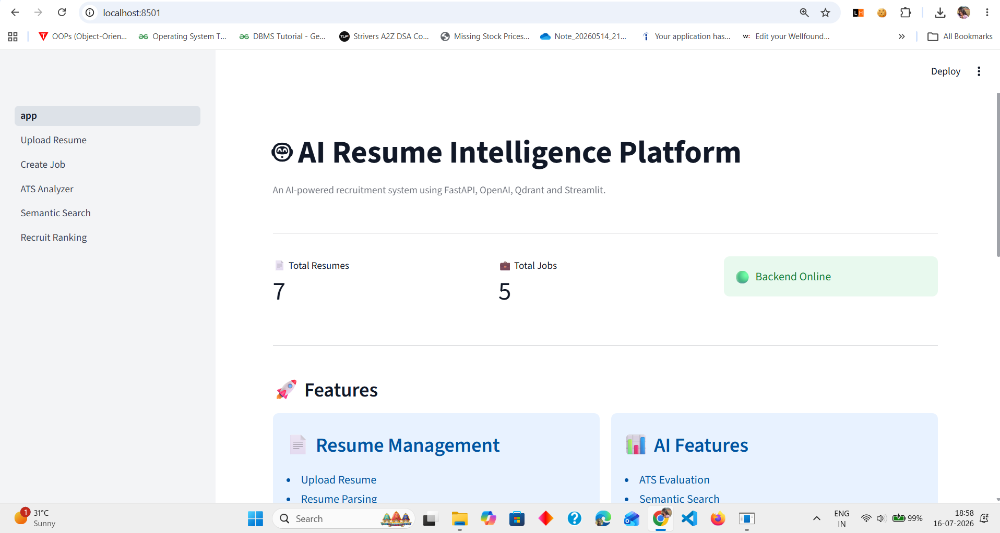
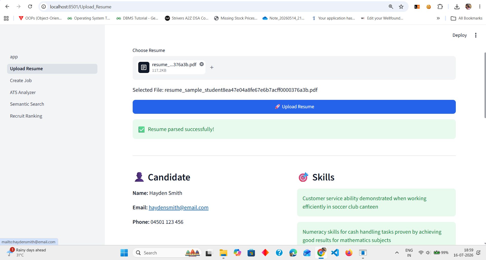
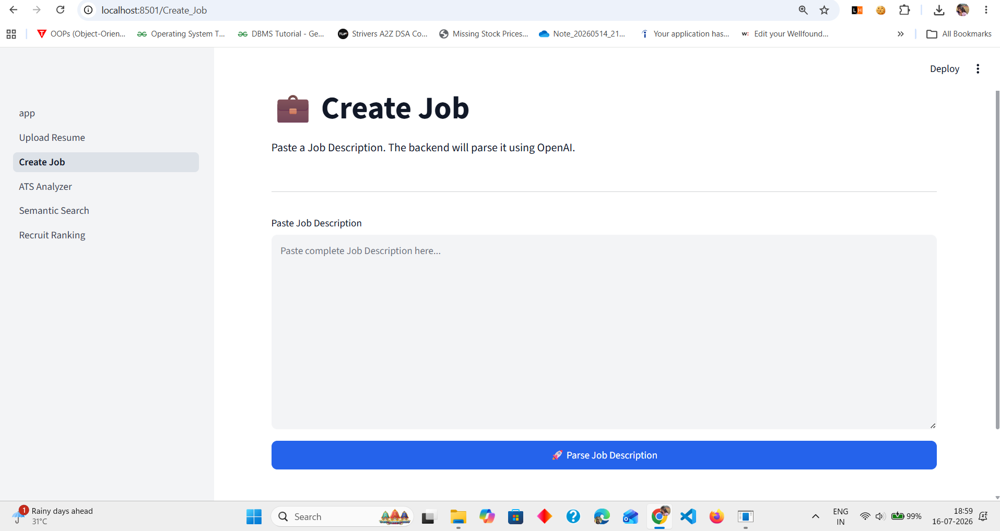
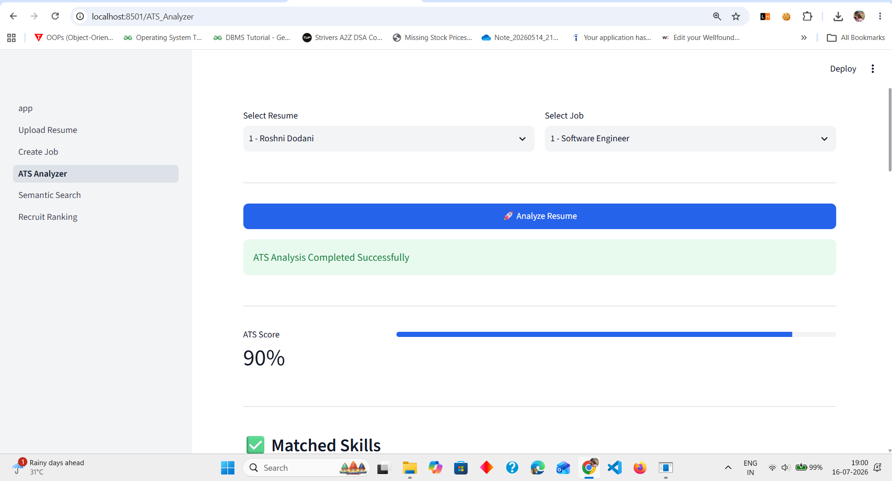
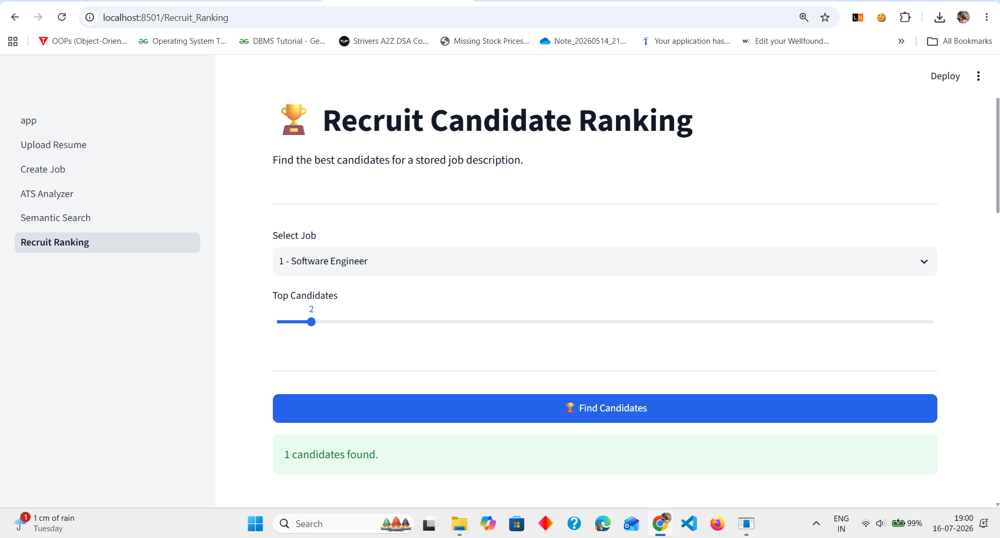

# 🤖 AI Resume Intelligence Platform

An AI-powered Resume Intelligence Platform built with **FastAPI**, **OpenAI**, **Qdrant**, **SQLAlchemy**, and **Streamlit**.

The platform automates resume parsing, job description analysis, ATS evaluation, semantic candidate search, and recruiter ranking using Large Language Models (LLMs) and vector embeddings.

---

## ✨ Features

### 📄 Resume Management

- Upload PDF/DOCX resumes
- Extract text automatically
- Parse resumes using OpenAI Structured Outputs
- Store structured resume data in SQLite
- Generate vector embeddings
- Store embeddings in Qdrant

---

### 💼 Job Management

- Paste any Job Description
- AI extracts:
  - Job Title
  - Skills
  - Experience
  - Education
  - Responsibilities
- Store parsed jobs in SQLite

---

### 📊 ATS Resume Analyzer

Compare any uploaded resume against a job description.

Generate:

- ATS Score
- Matched Skills
- Missing Skills
- Strengths
- Weaknesses
- Suggestions

---

### 🔍 Semantic Resume Search

Search resumes using natural language.

Example:

```
Python FastAPI Developer with Docker
```

The platform performs semantic similarity search using Qdrant embeddings.

---

### 🏆 Recruit Candidate Ranking

Automatically:

- Find relevant resumes
- Compare against a job
- Generate ATS reports
- Rank candidates by suitability

---

# 🛠 Tech Stack

## Backend

- FastAPI
- SQLAlchemy
- SQLite
- Pydantic

## AI

- OpenAI GPT
- OpenAI Embeddings

## Vector Database

- Qdrant

## Frontend

- Streamlit

## Other Tools

- Docker
- Requests
- Python

---

# 📂 Project Structure

```text
.
├── app/
│   ├── api/
│   ├── services/
│   ├── models/
│   ├── schemas/
│   ├── parsers/
│   └── core/
│
├── streamlit_app/
│   ├── pages/
│   ├── services/
│   └── app.py
│
├── docker-compose.yml
├── requirements.txt
└── README.md
```

---

# 🚀 Installation

## Clone Repository

```bash
git clone https://github.com/YOUR_USERNAME/ai-resume-intelligence.git
```

```bash
cd ai-resume-intelligence
```

---

## Create Virtual Environment

```bash
python -m venv venv
```

Windows

```bash
venv\Scripts\activate
```

Linux / Mac

```bash
source venv/bin/activate
```

---

## Install Requirements

```bash
pip install -r requirements.txt
```

---

## Configure Environment

Create a `.env` file.

```
OPENAI_API_KEY=your_key
OPENAI_MODEL=gpt-4.1-mini
QDRANT_URL=http://localhost:6333
```

---

## Start Qdrant

```bash
docker compose up
```

---

## Run Backend

```bash
uvicorn app.main:app --reload
```

Swagger

```
http://127.0.0.1:8000/docs
```

---

## Run Frontend

```bash
streamlit run streamlit_app/app.py
```

---

# 📸 Screenshots

## Dashboard



---

## Resume Upload



---

## 💼 Create Job



---

## ATS Analyzer



---

## Recruit Ranking



---

# Future Improvements

- Authentication
- Resume versioning
- PDF ATS report generation
- Email integration
- Multi-user support

---

# Author

**Roshni Dodani**

GitHub:
https://github.com/Roshae276